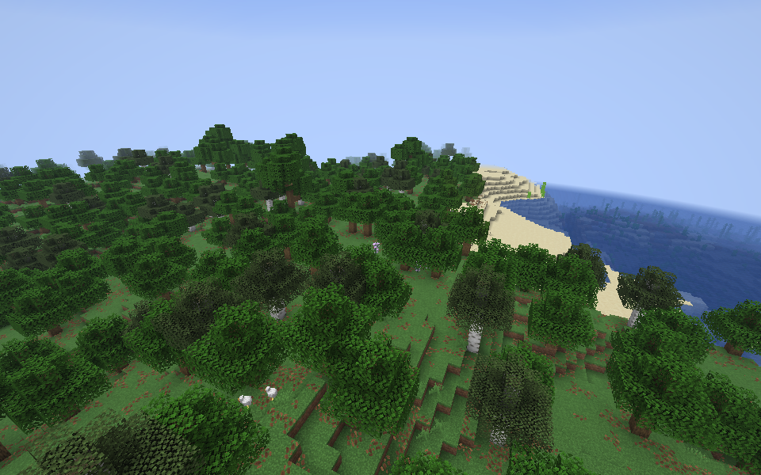

# Minecraft Metal

> [!IMPORTANT]
> **AI-generated project**
>
> This mod's custom implementation, tests, and project documentation were **completely AI-generated using Codex**. Human involvement consisted of direction, prompts, and testing; the custom implementation was not handwritten by the maintainer.
>
> Third-party tooling, dependencies, and license texts retain their original authorship. Gameplay screenshots and logs are actual captures, not AI-generated evidence. This is experimental software; the documented tests do not constitute an independent code or security audit.

A Fabric client mod implementing a native Apple Metal backend for Minecraft Java **26.3**. Minecraft submits its normal render passes through the RenderPearl frontend to a small Objective-C++ JNI library. Presentation uses a `CAMetalLayer` supplied by SDL's Metal view, with no OpenGL context.

Version **0.2.0** has been built and validated in real Minecraft 26.3 worlds on an Apple M3 Pro. Tests cover indexed indirect terrain, Improved Transparency off/on/off, overlapping glass, water, boat water masks, entities, particles, inventory, lighting, resource reload, resizing, and SDL fullscreen transitions. This remains an experimental backend; see [validation and limitations](docs/validation.md) for the exact scope. Sodium and Iris compatibility with 26.3 has not been established.



## Install

This is an experimental **client-only** mod for Minecraft **26.3**, Fabric Loader **0.19.3 or newer** (tested with 0.19.5), and native ARM64 Java **25 or newer** on Apple Silicon macOS. The native library targets macOS 14+; testing has been performed on macOS 26.5.2 with an M3 Pro. Intel Macs, Windows, and Linux are not supported rendering targets.

Install Fabric for Minecraft 26.3 in your launcher, create a separate game directory, and copy `minecraft-metal-renderer-0.2.0.jar` into its `mods` folder. Metal is selected automatically. The native library is included: players do not need Xcode, CMake, or a separate shader compiler. Use the normal mod JAR, not the sources JAR, and do not install the older 26.2 build alongside it.

Fabric API is **not required** to load this mod. A clean official-launcher profile with only the packaged mod, Fabric Loader 0.19.5, and the launcher's bundled ARM64 Java 25.0.1 successfully initialized the Metal backend. Fabric API is used by the development gameplay-test harness.

The clean installation also passed a user-performed visual walkthrough. See [packaged JAR and launcher validation](docs/launcher-validation.md) for the artifact hash, exact environment, public-source build check, and evidence scope.

Start with no other rendering mods or resource packs. Sodium, Iris, and shader packs are unverified. To disable this backend without removing the JAR, add `-Dmetal.enabled=false` to the launcher's JVM arguments.

## Build and run

Requirements:

- Apple Silicon Mac; macOS 14 or newer. Validation host: macOS 26.5.2, Apple M3 Pro.
- JDK 25 or newer. The project compiles for Java 25; validation used Homebrew OpenJDK 26.0.1.
- Xcode Command Line Tools, including Clang and the macOS SDK.
- CMake 3.22 or newer, available on `PATH`.

Run from the project directory:

```sh
./gradlew build
./gradlew nativeSmokeTest
./gradlew shaderSmokeTest transientMemorySmokeTest
./gradlew runClientGameTest
./gradlew runClientNaturalGameTest
MTL_DEBUG_LAYER=1 ./gradlew runClient
```

The `build` task also runs the native, shader, and transient-memory GPU checks. Gradle configures and builds the arm64 native library automatically and packages it at `native/macos-arm64/libminecraft_metal.dylib` in **`build/libs/minecraft-metal-renderer-0.2.0.jar`**. Use that versioned mod JAR, not the sources JAR or the older 0.1.0 build. The development client uses `run/` for saves, options, and logs. GPU checks and client game tests enable Metal API Validation; it can substantially reduce game performance when enabled for `runClient`.

The two client game tests launch real Minecraft instances, create disposable worlds, exercise the renderer, and save screenshots under `build/run/clientGameTest/screenshots/` and `build/run/clientNaturalGameTest/screenshots/`. The flat scene switches Improved Transparency off/on/off and checks that the boat water-mask pass executes. The natural scene checks indexed indirect terrain drawing, both transparency modes, movement, resource reload, and SDL fullscreen transitions. The test source set and renderer probe are excluded from the mod JAR. Both tasks require a fresh completion marker so a startup failure cannot be mistaken for a passing test. Run project Gradle commands sequentially; concurrent builds can replace class files while a development client is starting.

The pinned dependencies are Minecraft 26.3, Fabric Loader 0.19.5, Fabric API 0.161.0+26.3, and Fabric Loom 1.18.2. Minecraft supplies RenderPearl and LWJGL 3.4.3, including SDL, shaderc, and SPIRV-Cross. Gradle is provided by the checked-in wrapper.

For a normal launcher, install Fabric for Minecraft 26.3 and copy `minecraft-metal-renderer-0.2.0.jar` into that instance's `mods` folder. Metal is selected automatically on Apple Silicon macOS. The JAR contains the native library; no separate native installation or shader conversion tool is needed.

## Controls and diagnostics

- Add JVM option `-Dmetal.enabled=false` in a normal launcher to use Minecraft's selected graphics API. The development run configuration explicitly enables Metal.
- Add `-DminecraftMetal.dumpShaders=true` to retain translated MSL under the game's `debug/metal-shaders/` directory. Failed native shader compilations also save the translated shader pair.
- Use `MTL_DEBUG_LAYER=1` while diagnosing rendering errors. Search the client log for `Using graphics backend Metal` and `Metal device created` to confirm the selected backend.

The loader extracts each native build into a directory named by its SHA-256 hash under `~/.cache/minecraft-metal/`. This prevents a running or previously cached library from being mistaken for a new build.

## Troubleshooting

If native configuration fails, check that `cmake` is available and `xcode-select -p` points to a working Xcode or Command Line Tools installation. If Gradle reports an unsupported Java version, launch it with JDK 25 or newer. A missing bundled native library indicates that the native build or resource packaging did not finish; run `./gradlew build` again and inspect the first failure.

Metal initialization errors are reported directly. The mod does not silently fall back to OpenGL while Metal is enabled, because that would hide failures during validation. For compatibility testing, disable Metal explicitly with the JVM option above.

Fabric development clients use an offline development identity. Realms authorization and session-profile download warnings can occur independently of the rendering backend.

## Implementation

- [Architecture](docs/architecture.md): backend integration, shader binding, command recording, memory, and presentation.
- [Validation and limitations](docs/validation.md): evidence, known gaps, and next engineering work.
- [Compatibility](docs/compatibility.md): mod compatibility scope and unsupported features.
- [Upstream research](docs/upstream-research.md): actual 26.3 interfaces, transparency requirements, and MetalRender reference review.

The implementation is independent of MetalRender's hybrid rendering code. No OpenGL compositor, MoltenVK bridge, terrain interception, or replacement world mesher is involved.

## Source and feedback

Source and development history are hosted at [Kausik-Velaga/minecraft-metal-renderer](https://github.com/Kausik-Velaga/minecraft-metal-renderer). Report reproducible problems through the [issue tracker](https://github.com/Kausik-Velaga/minecraft-metal-renderer/issues); see [CONTRIBUTING.md](CONTRIBUTING.md) for testing and contribution expectations.

The project's own material is offered under the [MIT license](LICENSE), to the extent the contributors hold copyright or other licensable rights. This does not assert copyright over otherwise unprotected AI output or relicense third-party material. See [third-party notices](THIRD_PARTY_NOTICES.md) and the [license and provenance review](docs/license-and-provenance.md) for the exceptions, reference credits, and limits of the source comparison.
