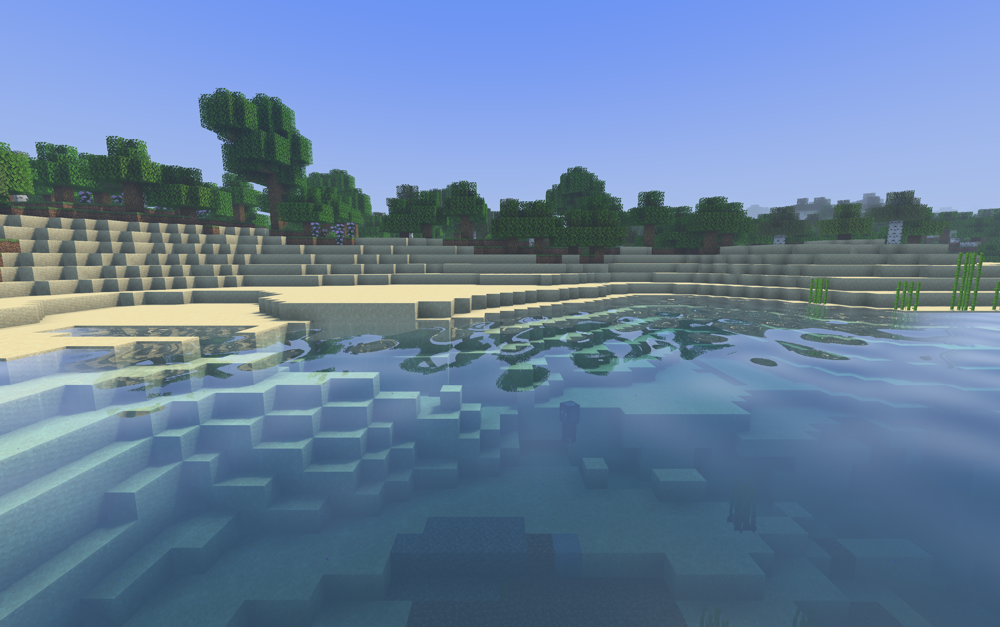

# Canopy: a Vibrant Visuals-inspired alternative

Canopy 0.2.0 is an original, separate MIT-licensed shader pack for this repository's Minecraft 26.3 Metal renderer and Shader Loader 0.1.3. Its priorities are recognizable Minecraft materials, geometric clouds, warm directional light, cool shadows, expressive water, and native-resolution performance. Solstice remains available as the lighter alternative. Canopy is not an official Mojang product or a port of Vibrant Visuals.

## Public research and reference images

Reviewed October 6, 2026. The [announcement article](https://www.minecraft.net/en-us/article/minecraft-vibrant-visuals) contains twelve screenshot files, including four side-by-side comparisons. All twelve were downloaded at their published sizes and visually inspected. Local originals, source URLs and SHA-256 hashes are retained in `.research/vibrant-visuals/references/`; [the URL/hash manifest](evidence/canopy-0.1.0/reference-images.json) is also retained with the evidence. These copyrighted references are excluded from the distributed pack. The supplied announcement transcript was used as additional design context.

The screenshots are appearance references, not measurements of scene radiance. Exposure, tone mapping, JPEG compression, weather, camera and resource settings are not fully specified. Even the comparison halves are not a calibrated inverse-rendering dataset. They can identify spatial relationships and likely visual priorities; they cannot recover exact light intensities, roughness maps, shader instructions or GPU costs.

| Reference | Close visual observation | Canopy response |
| --- | --- | --- |
| Jungle reflection / boat | Bank and boat silhouettes reflect in water; near water reveals depth; long bright highlights break into pixels. | View-angle-dependent reflection, opaque-scene reflection search, depth absorption and world-aligned ripple cells. |
| Forest | Warm patches on grass contrast with cool shade; leaves retain green; haze grows toward distant sunlit openings. | Separate sun and ambient palettes, wrapped leaf lighting, depth/height-dependent atmosphere. |
| Cherry grove comparison | Some foreground areas become darker while exposed grass becomes warmer. Pink blossoms keep their hue. | Preserve local light/shadow contrast and compress highlights with a shared RGB scale. Avoid treating the effect as a global brightness increase. |
| Mangrove beach comparison | Shaded sand shifts cool; lit edges warm; shallow water stays transparent while grazing surfaces reflect. | Warm direct light, blue ambient illumination, Fresnel reflection and colored transmission. |
| Woodland mansion comparison | Stone and glass acquire cooler responses while wood remains warm and textured. Shadows preserve block edges. | Block-specific roughness and metalness; no glossy coating on ordinary wood or foliage. |
| Tundra comparison and tundra landscape | Peach horizon contrasts with blue ice and snow shadows. Broad reflections and small sparkles coexist with crisp block silhouettes. | Cold-biome ambient tint, reflective ice material, restrained bloom and native-resolution scene detail. |
| Desert | Warm dusty distance, blue-gray water, visible shallow plants and angular clouds. | Temperature-dependent lighting, depth haze, clear shallow transmission and Minecraft cloud geometry. |
| Custom build | Copper, oxidized surfaces, vines and lights respond differently; glow stays localized. | A small material palette and procedural bright-texel emission masks. This does not reproduce Mojang's detailed material textures. |
| Mesa | Rust-colored terrain remains saturated; river highlights are bright; haze separates depth layers. | Hue-preserving highlight compression, directional haze and water sun highlights. |
| Both plains images | Canopy edges can glow without turning the whole tree white; long cast shadows anchor trees; clouds retain rectangular shapes. | Approximate foliage transmission, short-range pixel-aligned shadows and lit native block clouds. |

Mojang's [GDC 2026 rendering presentation](https://media.gdcvault.com/gdc2026/Slides/Fairfield_AJ_ModernizingTheRenderingOfMinecraft.pdf) documents a deferred opaque pipeline with forward transparent rendering, material channels, GGX lighting, screen-space reflections and pixel-aligned effects. It also describes authored/generated material textures, approximate subsurface lighting and colored-light propagation. These details support the interpretation of the images, but Canopy implements a much smaller forward shading design with an opaque color snapshot.

The official [water documentation](https://learn.microsoft.com/en-us/minecraft/creator/documents/vibrantvisuals/watercustomization?view=minecraft-bedrock-stable) describes image-driven waves, animated caustics and absorption controls. Canopy uses original procedural waves and caustics instead. The [lighting documentation](https://learn.microsoft.com/en-us/minecraft/creator/documents/vibrantvisuals/lightingcustomization?view=minecraft-bedrock-stable) distinguishes environment illumination, screen-space reflections and local lights; Canopy retains Minecraft's existing block-light field rather than implementing colored-light propagation. Mojang's [follow-up article](https://www.minecraft.net/en-us/article/evolving-vibrant-visuals-for-bedrock-edition) discusses later visual adjustments, so the announcement images should not be treated as a specification of every current release.

## Material assets in 0.2.0

Canopy now uses a loader-generated material atlas with 50 sprite recipes, including explicit ore and lamp masks. See [material authoring, loader behavior and current measurements](materials.md). The earlier image analysis below motivated this work; the historical 0.1.0 performance results remain labeled separately.

## Effect budget and deliberate limits

| Component | BALANCED implementation | Limit / cost control |
| --- | --- | --- |
| Lighting | Vertex ambient/block light and directional diffuse; wrapped leaf lighting | No indirect-light simulation or thickness-resolved subsurface scattering |
| Materials | Generated material atlas plus fallback block palette; GGX highlights and analytical sky reflection on selected materials | 50 annotated sprites; no normal maps or reflected local geometry on solid blocks; textures outside the block atlas use ordinary shading |
| Shadows | 1536² depth-only map, 80-block extent, two hardware-filtered comparisons, world-aligned 1/16-block receiver cells | Limited range; no transparent shadow casters, colored shadows or area-light simulation |
| Water | Opaque HDR color/depth snapshot, colored depth transmission, Fresnel reflection, eight search steps with two refinements on a hit | Only visible opaque geometry can reflect; sky fallback for misses; no displaced water mesh or refracted UV search |
| Caustics | Animated procedural pattern quantized to block texture scale | Artistic approximation, not focused light transport; underwater placement is approximate |
| Atmosphere | Camera-biome parameters, temperature, humidity, rain, distance, height and sun direction | Smooth biome transitions; no volumetric shadow rays or true shafts of light |
| Clouds | Minecraft's native geometric clouds with directional lighting | No cloud volume ray marching or cloud shadow map |
| Final image | Low-mip bloom, highlight compression, display encoding | One final pass; no TAA, motion blur, depth of field or extra edge-AA pass |

Water reads a distinct `colortex1` snapshot made after opaque rendering and writes `colortex0`. This avoids reading the active color attachment. The snapshot costs a fullscreen HDR read/write even when reflection search is disabled because water transmission still uses it. Ripple amplitude fades as its projected footprint becomes unresolved, reducing distant checkerboard aliasing. Pixel-aligned effects do not guarantee alias-free motion.

FAST disables screen-space reflection and reduces shadows to 1024² / 64 blocks. It keeps the lighting palette, materials, caustics and block clouds. Both profiles retain native scene resolution. The 90 FPS frame budget is **11.11 ms for the entire game frame**, not an allowance for the shader alone.

## Responsibilities

All new visual behavior lives in `shaderpacks/canopy/`. The existing loader handles custom uniforms, biome inputs, shader translation, shadow scheduling and opaque snapshots; the renderer handles Metal resources, synchronization and presentation; the scene optimizer handles scene work. The material-atlas extension is a generic opt-in loader capability; material identities and values stay in the pack. No Canopy-specific backend shader was added. Build and validation tasks support the separate pack archive.

## Build and select

```sh
./gradlew :shader-loader:canopyPack
```

The result is `shader-loader/build/shaderpacks/Canopy-0.2.0.zip`. Use the matching release mods; compatibility with other loaders has not been validated. Copy the ZIP into your game profile's `shaderpacks` directory and set `config/minecraft-shader-loader.properties`:

```properties
pack=Canopy-0.2.0.zip
profile=BALANCED
```

Change the pack filename to switch back to Solstice. Creating this archive does not change your saved launcher profile selection.

## Validation and measurements

The pack contract test checks distinct water input/output attachments, HDR preservation, dimension-specific shadows, reflection search removal in FAST, and finite smoothed biome uniforms. Native Metal compilation checks all 493 registered pipeline variants. The gameplay fixture covers water, night, rain, resize, reload, underwater rendering, particles, block entities, leaf breaking, walking, text, held-item glint and fire overlays. Screenshots are manually reviewed; passing these tests does not certify exact visual parity with Vibrant Visuals.

All listed checks passed. Natural-terrain validation also exercised movement, night, Nether and End entry, and return to the Overworld. The final cloud-fog adjustment was subsequently compiled across all 493 Metal variants and included in both visible measurements. Solstice's pack contract test also passed, and its archive hash stayed unchanged. [Validation record](evidence/canopy-0.1.0/validation.txt).

### Canopy 0.1.0 baseline measurements — October 6, 2026

Apple M3 Pro, 36 GB unified memory, native **3456×2168**, 16-chunk view distance and 12-chunk simulation distance. Minecraft 26.3 with the optimized local three-mod configuration, default Canopy settings (equivalent to BALANCED), ordinary visible presentation, VSync off and unlimited frame cap. Spark, stage profiling and Metal validation were disabled for timing. Both launch snapshots reported battery power and low-power mode off; power was not continuously controlled or recorded, so these are not controlled comparisons with the earlier AC-powered Solstice run.

| Metric | Forest walking / turning | Water-heavy shoreline |
| --- | ---: | ---: |
| Warmup / measurement | 30 s / 60 s | 10 s / 30 s |
| Average FPS, including stalls | **113.42** | **102.52** |
| Average frame interval | 8.82 ms | 9.75 ms |
| Median interval | 8.46 ms | 9.48 ms |
| 95th percentile interval | 10.67 ms | 11.33 ms |
| 99th percentile interval | 13.22 ms | 12.32 ms |
| Maximum interval | **781.96 ms** | 18.52 ms |
| Frames within 11.11 ms / 90 FPS budget | 6,561 / 6,806 (96.40%) | 2,860 / 3,076 (92.98%) |

The forest run completed six walking legs over 151.9 blocks without terrain edits. One 0.78-second hitch occurred at 40.19 seconds, with no meshing pending; its cause remains unresolved. Total JVM collection time was 123 ms, which alone does not explain that frame. No frames were removed from the statistics. Neither run had a failed GPU command buffer or drawable timeout.

These results exceed the 90 FPS **average** target in two measured scenes. They do not establish locked 90 FPS, all-biome coverage, heavily built worlds, or long-session thermal behavior. The earlier 137 / 114 / 110 FPS short offscreen probes were used for iteration and are not the reported visible performance results.

[Forest measurement](evidence/canopy-0.1.0/forest-benchmark.json) · [Forest launch configuration](evidence/canopy-0.1.0/forest-command.json) · [Water measurement](evidence/canopy-0.1.0/water-benchmark.json) · [Water launch configuration](evidence/canopy-0.1.0/water-command.json). Full raw frames, source/artifact hashes, logs and screenshots remain in `.research/vibrant-visuals/`.

Reproduce this historical baseline using `tools/benchmark-shader.py --pack shader-loader/build/shaderpacks/Canopy-0.1.0.zip`, a fresh `--label` and a closed disposable `--fixture`. Forest settings are `--warmup 30 --seconds 60 --action forestWalk`. Shoreline settings are `--warmup 10 --seconds 30 --position 135 65 240 --look -90 8`. The recorded manifests include all renderer and optimizer flags. No saved player world or launcher selection was changed.


