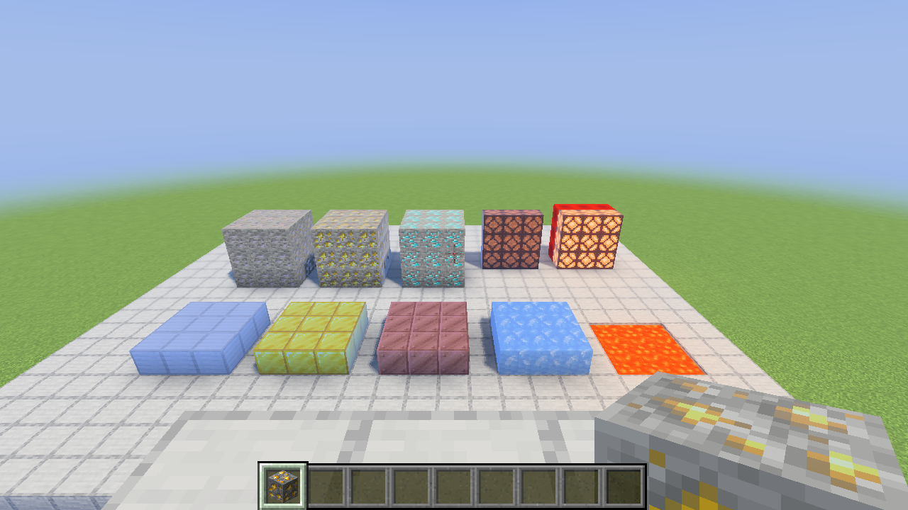
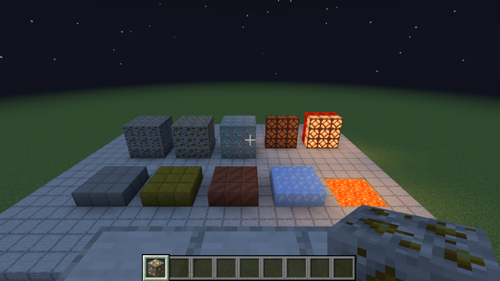

# Material assets and generated atlases

The shader loader now supports an opt-in material atlas. Canopy 0.2.0 uses it for **50 sprite definitions**, including explicit 16×16 masks for iron ore, gold ore, diamond ore, and powered/unpowered redstone lamps. Uniform presets cover selected metals, polished surfaces, gems, glass, ice, leaves, fire, lava and sea lanterns.

Ore masks separate mineral pixels from stone. Lamp masks separate frames from glass and distinguish powered emission from an unpowered surface. Canopy's brightness-derived roughness adjustment has been removed. Unannotated sprites retain category defaults, including the earlier emission approximation for unannotated luminous blocks.

## Ownership and preparation

- **Pack:** supplies reusable presets and explicit masks in `shaders/materials.json`, declares `materialPalette=materials.json`, and chooses how material values affect lighting.
- **Loader:** validates recipes before activation, generates a companion to Minecraft's block atlas, matches sprite positions/padding/mip levels, manages bindings and resource reloads.
- **Renderer:** ordinary texture allocation, upload and sampling; no ore, lamp or Canopy-specific code.
- **Scene optimizer:** scene selection and draw preparation remain independent of the material textures.

Generation runs once on the render thread at first use and again when the game's atlas is replaced. The atlas survives dimension changes. No images are regenerated or uploaded during ordinary frames. Generation is not yet part of asynchronous resource preparation, and there is no persistent disk cache. The measured 2048² RGBA8 companion with five mip levels occupies **22,347,776 bytes (21.31 MiB)**. Packs that do not read `materialtex` allocate no material atlas.

## Data contract

`materialtex` is an explicit loader sampler, separate from legacy normal/specular samplers and LabPBR. It binds the companion only when the draw's albedo is the block atlas. Other textures receive an unannotated one-pixel fallback. It follows albedo binding changes, preventing stale terrain bindings on unrelated draws.

| Channel | Meaning |
| --- | --- |
| R | Metalness, 0–1 |
| G | Emission, 0–1; the pack controls its lighting scale |
| B | Roughness, 1/255–1 |
| A | Subsurface/transmission, 0–1 |

Roughness zero means **unannotated**. These are linear data values. Mip generation averages channels independently, without sRGB conversion or alpha premultiplication. Sprite padding repeats edge values. Nearest texel sampling with mip selection preserves the texture grid while reducing distant aliasing. This is simple parameter filtering, not a physically exact roughness-variance filter.

The JSON schema is version 1. Presets specify `metalness`, `emission`, `roughness`, and `subsurface`, defaulting to 0, 0, 1, and 0. A sprite recipe either names a preset or supplies rectangular symbolic `mask` rows and a `legend` mapping symbols to presets. See [the authored library](../shaderpacks/canopy/shaders/materials.json).

Masked recipes include the SHA-256 of their source color PNG as `albedoSha256`. The file hash and sprite dimensions must match, and the sprite must be static. A changed texture disables its old mask; even a visually identical PNG re-encoding conservatively needs an updated hash. Uniform presets remain valid on resized or animated sprites because they have no pixel-placement dependency.

This initial guard checks conventional `textures/<sprite-path>.png` sources. Custom atlas remapping or derived sprites are not verified by that file lookup and need an explicit material override.

## Resource-pack overrides and limits

Resource packs can supply a packed material PNG at `assets/<namespace>/shader_materials/<sprite-path>.png`. For example, `assets/minecraft/shader_materials/block/gold_ore.png` annotates `minecraft:block/gold_ore`. Its dimensions must match one sprite frame. Overrides take priority over pack recipes and can add annotations for other block-atlas sprites. The separate directory keeps data maps out of the color atlas.

PNG alpha contains subsurface data, not opacity. Exporters must preserve RGB even where alpha is zero. Explicit overrides do not require hashes: their author is responsible for pairing material and color art.

Uniform materials work on animated sprites. Nonuniform maps on animated sprites are skipped; multi-frame material sheets are unsupported. Synchronizing varying masks with Minecraft's frame sequence and interpolation remains future work. Normal maps, separate entity/item atlases, and complete vanilla coverage are also outside this first implementation.

The presets and masks are our annotations of locally installed Minecraft 26.3 texture layouts. Source hashes record that dependency. No vanilla color textures or Mojang Vibrant Visuals material maps are packaged, and no Mojang material-generation tooling is used.

## Verification and performance

`materialPaletteTest` covers mixed ore properties, unpowered lamp emission, source/animation guards, padding, independent channel reduction, and invalid recipes. The material gameplay test renders a day/night gallery, reloads resources, adds a temporary resource pack, and removes it again. It verifies all 50 vanilla mappings, steady-state reuse, stale iron-ore mask rejection, an explicit gold-ore override with zero PNG alpha, and restoration after removing the override. The native smoke test compiles all 493 registered pipeline variants.

Run `./gradlew :shader-loader:materialPaletteTest` and `./gradlew :shader-loader:runClientMaterialGameTest -PshaderPack=/absolute/path/to/Canopy-0.2.0.zip`. Gameplay validation uses a disposable world and installation.

On the M3 Pro at native 3456×2168, a short offscreen stationary forest comparison measured 140.19 FPS / 7.13 ms with Canopy 0.1.0 and 136.29 FPS / 7.34 ms with 0.2.0. That is an observed **0.20 ms/frame** increase in one exploratory pair, not an isolated or statistically established atlas cost. Material handling and a roughness heuristic both changed.

The final visible test used 30 seconds of warmup and 60 seconds of forest walking with default Canopy 0.2.0 effects: **113.64 FPS average**, 8.80 ms mean, 10.66 ms p95 and 12.60 ms p99. An unresolved **517.12 ms hitch** remains included; this is not locked 90 FPS. The material atlas was built once before measurement and stayed at one generation throughout. The old-pack control allocated zero atlas bytes.

Raw results, commands, source hashes and logs are in `.research/canopy-materials/`; compact evidence and screenshots are in [the evidence directory](evidence/canopy-0.2.0/). These are measurements of the optimized local three-mod configuration, not a claim about published binaries or all worlds.

