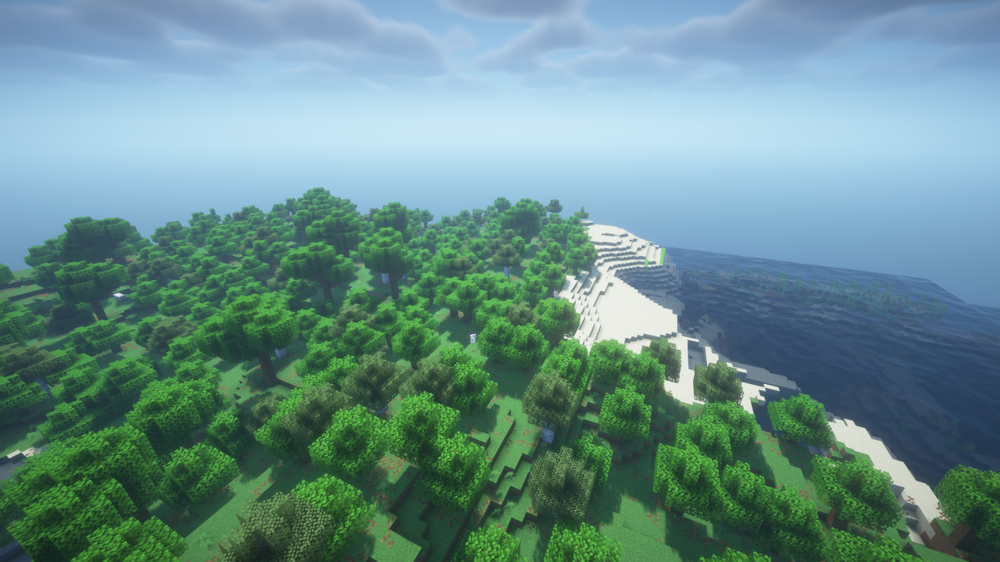

# Shader-loader validation

Release pair: Minecraft Metal **0.2.1** and Minecraft Shader Loader **0.1.0**.

Validation host: Apple M3 Pro, macOS 26.5.2, Minecraft 26.3, Fabric Loader 0.19.5, and ARM64 Homebrew
Java 26.0.1. The supplied pack is BSL 10.1.8. Its default settings are used unless a test explicitly
checks rejection of an unsupported option. Pack source and assets are not stored in this repository.

## GPU and translation checks

The loader's `check` task exercises configuration parsing, conditional preprocessing, uniform byte
layouts, geometry attributes, material IDs, and real GPU readback. Readback tests cover rectangular
and HDR mipmaps, shadow comparison filtering, alpha rejection preserving both color and depth,
framebuffer coordinate conventions, depth snapshots/merging, and reset of both temporal-buffer
sides. The BSL smoke task separately compiles supplied pack programs and actual Minecraft draw
**123 pack and adapter pipeline variants** through the Metal driver.

The boat water-mask check uses the actual Minecraft pipeline and verifies that its depth-only draw
changes scene depth while leaving every scene color pixel intact. Leash, beacon, and translucent
entity adapters are included in the BSL driver smoke test. Spectral-effect entities do not yet select
the optional `gbuffers_entities_glowing` program; emissive materials are not treated as spectral effects.

These checks found and corrected a renderer mipmap bug: the inherited texture-size calculation
returned zero for the tail of narrow textures. The renderer now clamps each mip extent to one.

## Gameplay evidence

The completed flat-world run covers daylight, night, water, glass, vegetation, shadows, particles,
camera movement, rain, resizing, resource reload, underwater rendering, a chest, an End portal,
an End crystal, hurt overlays, beacon beams, a boat water mask, leashes, and returning to the menu.
The last three geometry categories are asserted from actual scene draws. Visual review confirmed the sky reaches the horizon,
leaf cutouts are retained, and the first-person player and sword cast shadows.

GPU diagnostics confirmed more than 2.1 million populated pixels in the 2048×2048 shadow map, with
finite scene/shadow depths and color values. Material diagnostics confirmed BSL's actual End portal
ID 25200 and End crystal ID 10102 reach their draws. These IDs come from the pack's mapping files.

The game tests use Metal API Validation and controlled scheduling. Their reported FPS is not a
performance benchmark. A second run uses seed 1, eight-chunk natural terrain at 1280×720, flight,
night, Nether/End travel, and return to the Overworld. Every dimension has finite, populated scene
depth and uses indexed indirect terrain draws. The End also has over 2.17 million populated shadow
pixels after correcting its fixed light direction. Natural day, night, Nether, End, underwater, and
feature captures were visually inspected.

The full [build/GPU/gameplay log](evidence/shaders/build-and-gameplay.log) and independent
[renderer regression log](evidence/shaders/renderer-gameplay.log) record passing checks. The latter
covers the renderer without the loader, including Improved Transparency.



Additional captures: [night](evidence/shaders/bsl-natural-night.png), [Nether](evidence/shaders/bsl-nether.png),
[End](evidence/shaders/bsl-end.png), [underwater](evidence/shaders/bsl-underwater.png), and
[beacon, boat, and leash](evidence/shaders/bsl-features.png).

## Packaged installations

Both exact production JARs were launched through Loom's production-client launcher using vanilla
Minecraft and Fabric Loader in isolated game directories. One run installed the renderer alone;
the other installed the renderer and loader with BSL. **Fabric API was absent in both.** A separate
test-only probe opened a disposable world, verified the backend and mod set, captured an image,
and exited. The probe is excluded from the release JARs. This is an automated installation check,
not an interactive walkthrough of the official launcher.

Both captures were visually inspected: [renderer only](evidence/shaders/packaged-renderer.png)
and [paired BSL installation](evidence/shaders/packaged-bsl.png). The [renderer report](evidence/shaders/packaged-renderer.json)
and [BSL report](evidence/shaders/packaged-bsl.json) record the loaded mods. Logs:
[renderer](evidence/shaders/packaged-renderer.log), [BSL](evidence/shaders/packaged-bsl.log).
Offline test launches produce account/Realms authentication messages; optional Indigo mixins also
report missing target classes when Fabric API is absent. The completion checks verify successful
world rendering rather than treating process exit alone as success.

[Artifact hashes and sizes](evidence/shaders/artifacts.json) identify the files tested and released.
Inspection confirmed separate mod namespaces, no nested mods, no test/benchmark code in the
production JARs, and no bundled BSL source, textures, or ZIP. The renderer contains its ARM64 native
library; the loader does not duplicate it.

## Reproduce

Run Gradle sequentially on an Apple Silicon Mac, supplying your own pack:

```sh
./gradlew --no-parallel build
./gradlew --no-parallel :shader-loader:bslShaderSmokeTest -PshaderPack=/absolute/path/to/BSL_v10.1.8.zip
./gradlew --no-parallel :shader-loader:runClientGameTest -PshaderPack=/absolute/path/to/BSL_v10.1.8.zip
./gradlew --no-parallel :shader-loader:runClientNaturalGameTest -PshaderPack=/absolute/path/to/BSL_v10.1.8.zip
```

Client screenshots and depth diagnostics are saved under each task's `shader-loader/build/run/`
directory. A fresh completion marker is required for a passing client task. Screenshots still need
visual inspection; an empty frame can otherwise satisfy a no-crash test.

The normal-client benchmark copies the disposable flat scene. It uses a separate test-only mod,
disables Metal validation and VSync, leaves the normal game loop in control, warms up for 30 seconds,
then records every frame interval for 60 seconds. Both configurations use classic transparency,
1280×720 pixels, five-chunk render/simulation distance, and a fixed daylight viewpoint. It retains
stalls and reports frame-time percentiles, GC counts, and raw intervals.

Measured on 2026-10-03 UTC on the validation host above, with 51 visible sections in all three runs:

| Configuration | Frames / measured seconds | Mean FPS | Mean frame ms | p50 ms | p95 ms | p99 ms | Maximum ms | GC collections / ms |
| --- | ---: | ---: | ---: | ---: | ---: | ---: | ---: | ---: |
| Metal, no pack selected | 8,987 / 60.004 | 149.77 | 6.677 | 8.202 | 9.248 | 9.813 | 35.962 | 0 / 0 |
| Metal, BSL defaults — sample 1 | 6,905 / 60.019 | 115.05 | 8.692 | 8.324 | 9.366 | 27.355 | 38.973 | 2 / 53 |
| Metal, BSL defaults — sample 2 | 7,198 / 60.008 | 119.95 | 8.337 | 8.341 | 9.258 | 10.388 | 26.257 | 2 / 34 |

These are start-to-start wall-clock frame intervals, including presentation, integrated-server work,
and garbage collection. The final BSL samples show run-to-run variation: p99 ranges from 10.4 to
27.4 ms, with slower frames clustered in sample 1. This remains a frame-pacing limitation; its cause
has not been isolated. Both samples use the same finished code and pack defaults, and neither
removes slow frames.

Median intervals near 8.3 ms, combined with a baseline mean above 120 FPS, suggest presentation
pacing mixed with faster bursts. This is an inference, not a measured GPU bottleneck. These runs
do not measure GPU execution time or establish maximum throughput; the results do not demonstrate
a GPU performance improvement or precisely quantify shader overhead.

The [baseline report](evidence/shaders/baseline.json) and [BSL report](evidence/shaders/bsl-default.json)
include settings and GC counts. Raw intervals: [baseline CSV](evidence/shaders/baseline.csv) and
[BSL sample 1 CSV](evidence/shaders/bsl-default.csv). The repeat has its own
[report](evidence/shaders/bsl-repeat.json) and [raw CSV](evidence/shaders/bsl-repeat.csv). The selected BSL ZIP's
SHA-256 is `36b0a50ff7918bf10e9422c401d93779f9d0088a26acea975b435243f96930b5`.

```sh
./gradlew --no-parallel :shader-loader:runClientBenchmarkBaseline
./gradlew --no-parallel :shader-loader:runClientBenchmarkBsl -PshaderPack=/absolute/path/to/BSL_v10.1.8.zip
```

This compares the cost of adding BSL to the Metal renderer in one fixed scene. It does not establish
a speedup over other renderers, shaders, or hardware, and it is not a prolonged gameplay test.
