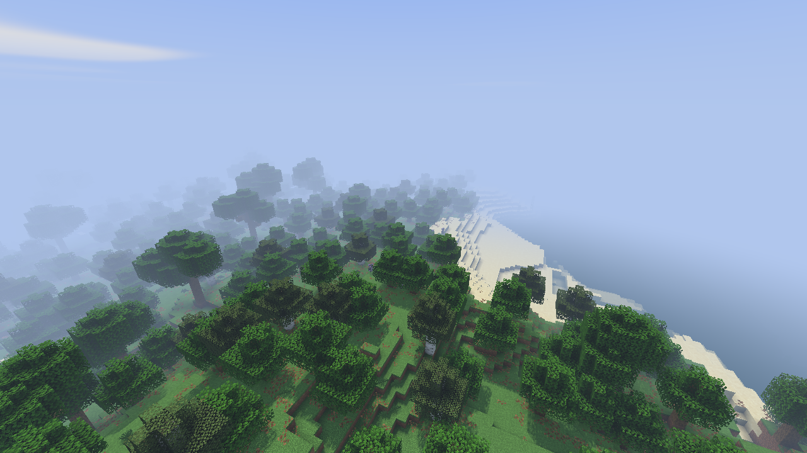

# Solstice: a lighter native-resolution shader

Solstice 0.1.0 is an original MIT-licensed pack in `shaderpacks/solstice`, built for Minecraft 26.3 and the development versions of this repository's mods. It is a separate visual design, not BSL with hidden quality reductions. Native scene resolution is preserved.

## Rendering choices

| Effect | Implementation | Visual tradeoff |
| --- | --- | --- |
| Lighting | Vertex ambient/sky/block light, directional sunlight and moonlight | No indirect-light simulation |
| Shadows | 1536² depth map, 64-block range, two hardware-filtered comparisons, light-space texel snapping | Limited distance and softness; transparent objects do not cast shadows |
| Ambient occlusion | Minecraft vertex AO | No screen-space contact occlusion |
| Atmosphere | Distance/weather fog and two-octave sky-cloud noise | No volumetric clouds or light shafts |
| Water | Two analytical ripples, Fresnel sky color, depth attenuation | No reflections of nearby geometry or refraction |
| Post-processing | One final pass, low-mip bloom, highlight compression, display encoding | No temporal AA, motion blur, depth of field, or spatial edge-AA pass |

The default BALANCED profile enables every implemented effect. LITE disables shadows and bloom. The source uses only the required scene routes and shares small library files between dimensions.

## Module boundaries

- **Pack:** aesthetic choices, lighting equations, effect budgets, and quality presets.
- **Shader loader:** translates and schedules the pack, discovers sampler dependencies, and skips unused depth snapshots, shadow-depth copies, and final hand-depth merges. `shadow.translucent=false` skips transparent shadow casters; `shadow.texelSnap=true` opts into light-space grid snapping for linear orthographic shadows. Existing packs retain their default shadow behavior.
- **Metal renderer:** command submission, resource synchronization, sampling, mip generation, and presentation. No Solstice-specific renderer code is needed.
- **Scene optimizer:** scene selection and draw preparation. No Solstice-specific scene-optimizer code is needed.

The loader extensions are optional and have not been validated with other shader loaders. Snapping stabilizes camera translation at a fixed light direction; it does not stop the sun or remove all shadow shimmer.

## Build and use

Build the pack with `./gradlew :shader-loader:solsticePack`. Its ZIP is under `shader-loader/build/shaderpacks/`. Use locally built renderer and shader-loader JARs; the published shader-loader release predates this pack. Put the ZIP in the profile's `shaderpacks` directory and configure:

```properties
pack=Solstice-0.1.0.zip
profile=BALANCED
```

The configuration file is `config/minecraft-shader-loader.properties`. See [loader setup](shader-loader.md). The scene optimizer is optional for loading the pack, but is included in the optimized benchmark configuration.

## Reproducible measurements

`tools/benchmark-shader.py` launches an isolated packaged game with explicit native 3456×2168 resolution, 16-chunk view distance, 12-chunk simulation distance, fixed time and a copied disposable world. It records the exact command, environment, source identities, pack hash, timing samples and screenshot. It refuses reused result labels. It does not modify the source world.

```sh
python3 tools/benchmark-shader.py --label solstice-check \
  --fixture /absolute/path/to/closed/disposable/seed-1-world \
  --warmup 30 --seconds 60 --action forestWalk
```

The default short 5-second warmup/10-second sample is exploratory. `--offscreen` bypasses presentation and must not be advertised as visible gameplay FPS. `--stages` enables GPU timing and is diagnostic. Normal reported runs use neither flag. FPS is calculated from all measured frame intervals, including stalls.

The script explicitly enables hardware shadow comparison, native mipmaps, vertex/fragment SPIR-V optimization, shared terrain matrices, compact terrain vertices, lazy clears, fullscreen attachment discard, scene draw metadata caching, asynchronous scene indexing, and indirect commands. It uses tracked hazards and safe floating-point math. These settings are recorded in the command manifest; results are not a claim about an unconfigured published launcher profile. Spark and stage profiling are off for timing.

## Cleanup and validation

Removed 29 obsolete benchmark probe classes/mixins (roughly 3,500 lines), their registrations, forwarded options, and hooks. Retained the real frame statistics, Spark integration, input identities, gameplay actions, screenshots and visual-comparison tooling. The general pack compilation test now handles both BSL and Solstice. Existing BSL compatibility remains supported.

Targeted tests cover all registered shader routes, all three pack dimensions, depth-only shadow attachments, HDR scene format, disabled-effects dependencies, and world-anchored shadow snapping. Gameplay checks exercise rendering beyond a stationary landscape. The validation summary is retained in [evidence](evidence/solstice-0.1.0/validation.txt).

## Measured result — October 6, 2026

Apple M3 Pro, 36 GB unified memory, AC power, low-power mode off. BALANCED defaults, native 3456×2168, normal presentation, VSync off, unlimited frame cap. Thirty-second warmup followed by sixty seconds containing five seconds stationary, fifty seconds of forest walking/turning, and five seconds stationary. Six route legs completed, totaling 163.1 blocks; no terrain edits or failed GPU command buffers.

| Metric | Measured |
| --- | ---: |
| Average FPS (all frames, including stalls) | **122.44** |
| Average frame interval | 8.17 ms |
| Median interval | 8.00 ms |
| 95th percentile interval | 9.59 ms |
| 99th percentile interval | 11.70 ms |
| Maximum interval | **1020.30 ms** |
| Frames within the 11.11 ms / 90 FPS budget | 7,248 / 7,347 (98.65%) |

The run exceeds the 90 FPS average target, but does not establish locked 90 FPS. One 1.02-second hitch occurred about 52 seconds into measurement, during walking, with no meshing pending. Its cause is unresolved. Aggregate JVM collection time was only 93 ms; that metric alone does not explain it. No hitch was filtered out. Further work should focus on identifying these stalls before adding more visual effects.

The earlier ten-second offscreen diagnostic measured 183.25 FPS in a different stationary view. It guided the initial decision to proceed; it is not a comparable visible-play result. The first walking run failed route validation and is excluded from performance claims. The selector now checks jump headroom and fails after ten seconds without waypoint progress.

[Measurement summary](evidence/solstice-0.1.0/benchmark.json) · [Exact launch configuration](evidence/solstice-0.1.0/benchmark-command.json). Full local raw frames, inputs, logs, screenshots, and failure evidence remain in `.research/solstice/`. Completed disposable installations from the failed/early runs were removed (about 117 MiB); source fixtures and measurement evidence were retained.


